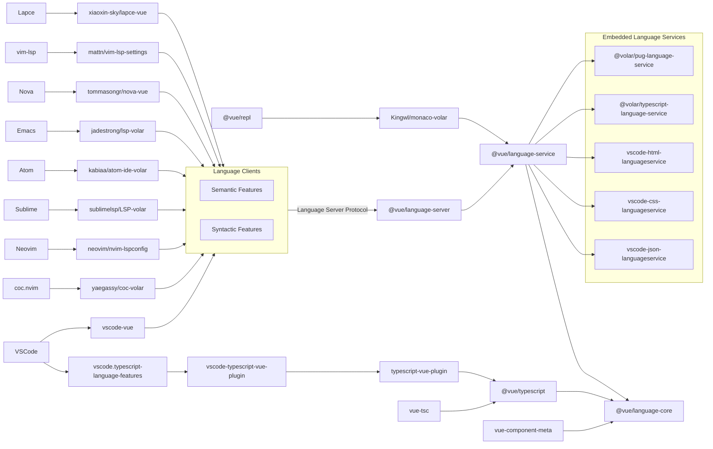

# Vue Language Tools

> ⚡ High-performance Vue language tooling based-on [Volar.js](https://volarjs.dev/)

Discord: https://discord.gg/5bnSSSSBbK

<table>
	<tbody>
		<tr>
			<td align="center" colspan="6">
				<br><a href="https://stackblitz.com/"></a>
				<br><a href="https://blog.stackblitz.com/posts/webcontainer-api-is-here/">WebContainer API is here.</a>
				<br>In 2021 <a href="https://blog.stackblitz.com/posts/introducing-webcontainers/">we announced
					WebContainers</a>, a novel WebAssembly-based operating system which enables Node.js to run entirely
				inside the browser. Over the last two years, millions of developers have used WebContainers each month
				as it powers, among others, the StackBlitz editor.
			</td>
		</tr>
		<tr>
			<td align="center" colspan="6"><b>Sponsors</b></td>
		</tr>
		<tr>
			<td align="center"><a href="https://www.prefect.io/"></a></td>
			<td align="center" colspan="5">
				<a href="https://nuxt.com/"></a>
				<br>The Intuitive Vue Framework
			</td>
		</tr>
		<tr>
			<td align="center" colspan="5">
				<a href="https://vuejs.org/"></a>
				<br>The Progressive JavaScript Framework
			</td>
			<td align="center"><a href="https://www.programmier.bar/"></a></td>
		</tr>
		<tr>
			<td align="center"><a href="https://www.leniolabs.com/"></a></td>
			<td align="center" colspan="5">
				Support us via
				<a href="https://github.com/sponsors/johnsoncodehk">GitHub Sponsors</a>
				or
				<a href="https://opencollective.com/volarjs">Open Collective</a>
			</td>
		</tr>
		<tr>
			<td></td>
			<td></td>
			<td></td>
			<td></td>
			<td></td>
			<td></td>
		</tr>
	</tbody>
</table>

## Packages

- [Vue Language Features](https://github.com/vuejs/language-tools/tree/master/extensions/vscode) \
*Vue, Vitepress, petite-vue language support extension for VSCode*
- [TypeScript Vue Plugin](https://github.com/vuejs/language-tools/tree/master/extensions/vscode-typescript-plugin) \
*VSCode extension to support Vue in TS server*
- [vue-tsc](https://github.com/vuejs/language-tools/tree/master/packages/tsc) \
*Type-check and dts build command line tool*
- [vue-component-meta](https://github.com/vuejs/language-tools/tree/master/packages/component-meta) \
*Component props, events, slots types information extract tool*
- [vite-plugin-vue-component-preview](https://github.com/johnsoncodehk/vite-plugin-vue-component-preview) \
*Vite plugin for support Vue component preview view with `Vue Language Features`*

## Community Integration

[yaegassy/coc-volar](https://github.com/yaegassy/coc-volar) ⚡ 🤝 🅿️ \
*Vue language client for coc.nvim*

[neovim/nvim-lspconfig](https://github.com/neovim/nvim-lspconfig) ⚡ 🤝 \
*Vue language server configuration for Neovim* \
[[Multiple servers set up tutorial](https://github.com/vuejs/language-tools/discussions/606)]

[mattn/vim-lsp-settings](https://github.com/mattn/vim-lsp-settings) ⚡ \
*Vue language server auto configuration for vim-lsp*

[sublimelsp/LSP-volar](https://github.com/sublimelsp/LSP-volar) 🤝 \
*Vue language client for Sublime*

[kabiaa/atom-ide-volar](https://github.com/kabiaa/atom-ide-volar) \
*Vue language client for Atom*

[emacs-lsp/lsp-mode](https://github.com/emacs-lsp/lsp-mode) ([jadestrong/lsp-volar](https://github.com/jadestrong/lsp-volar)) ⚡ 🤝 \
*Vue language client for Emacs*

[tommasongr/nova-vue](https://github.com/tommasongr/nova-vue) \
*Vue language client for Nova*

[xiaoxin-sky/lapce-vue](https://github.com/xiaoxin-sky/lapce-vue) \
*Vue language client for Lapce*

[Kingwl/monaco-volar](https://github.com/Kingwl/monaco-volar) \
*Vue language support for Monaco on Browser*

[WebStorm](https://www.jetbrains.com/webstorm/) \
*Built-in integration for `@vue/language-server`*

[Eclipse WildWebDeveloper](https://github.com/eclipse-wildwebdeveloper/wildwebdeveloper) \
*Vue language server configuration for Eclipse*

\* ⚡ support [multiple servers](https://github.com/vuejs/language-tools/discussions/393#discussioncomment-1213736) \
\* 🤝 support [take over mode](https://github.com/vuejs/language-tools/discussions/471) \
\* 🅿️ support [extra preview features](https://twitter.com/johnsoncodehk/status/1507024137901916161)

## Contribution Guide

If you want to work on the volar extension follow these commands to set up your local development environment.

🔎 Note that you will need pnpm - you can download it here: https://pnpm.io/installation.

```bash
git clone https://github.com/vuejs/language-tools.git
cd language-tools
pnpm install
pnpm run build
```

The recommended way to develop the volar extension is to use the [Debug Tools](https://code.visualstudio.com/Docs/editor/debugging) provided by VSCode.
Alternatively, you can run one of the scripts defined in the [package.json](https://github.com/vuejs/language-tools/blob/master/package.json) file.

❗ You should always use the debug launch configs or package.json scripts defined in the root of the project.

Additional info for contributing to open source projects can be found here: https://docs.github.com/en/get-started/quickstart/contributing-to-projects

To develop with upstream Volar.js modules, you can setup workspace with https://github.com/volarjs/workspace.

## High Level System Overview



---

<p align="center">
	<a href="https://cdn.jsdelivr.net/gh/johnsoncodehk/sponsors/sponsors.svg">
		
	</a>
</p>
