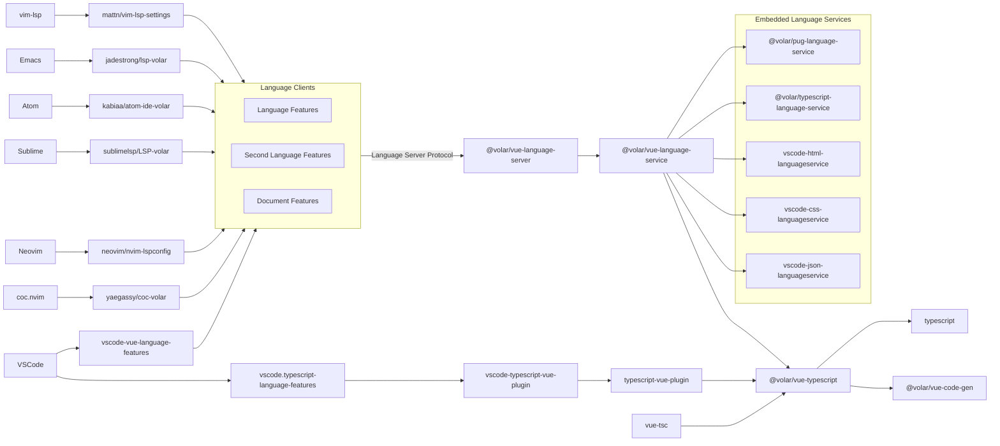

# Volar

> ⚡ Explore high-performance tooling for Vue

- [Vue Language Features](https://github.com/johnsoncodehk/volar/tree/master/extensions/vscode-vue-language-features) (👈 The Main VSCode Extension)\
*Vue language support extension for VSCode*
- [TypeScript Vue Plugin](https://github.com/johnsoncodehk/volar/tree/master/extensions/vscode-typescript-vue-plugin) \
*VSCode extension to support Vue in TS server*
- [vue-tsc](https://github.com/johnsoncodehk/volar/tree/master/packages/vue-tsc) \
*Type-check and dts build command line tool*

Discord: https://discord.gg/5bnSSSSBbK

## IDE Supports by Community

[yaegassy/coc-volar](https://github.com/yaegassy/coc-volar) ⚡ 🤝 \
*Vue language client for coc.nvim*

[neovim/nvim-lspconfig](https://github.com/neovim/nvim-lspconfig) ⚡ 🤝 \
*Vue language server configuration for Neovim* \
[[Multiple servers set up tutorial](https://github.com/johnsoncodehk/volar/discussions/606)]

[mattn/vim-lsp-settings](https://github.com/mattn/vim-lsp-settings) ⚡ \
*Vue language server auto configuration for vim-lsp*

[sublimelsp/LSP-volar](https://github.com/sublimelsp/LSP-volar) 🤝 \
*Vue language client for Sublime*

[kabiaa/atom-ide-volar](https://github.com/kabiaa/atom-ide-volar) \
*Vue language client for Atom*

[emacs-lsp/lsp-mode](https://github.com/emacs-lsp/lsp-mode) ([jadestrong/lsp-volar](https://github.com/jadestrong/lsp-volar)) ⚡ 🤝 \
*Vue language client for Emacs*

\* ⚡ support [multiple servers](https://github.com/johnsoncodehk/volar/discussions/393#discussioncomment-1213736) \
\* 🤝 support [take over mode](https://github.com/johnsoncodehk/volar/discussions/471)

## High Level System Overview

## Sponsors

  

---

  

